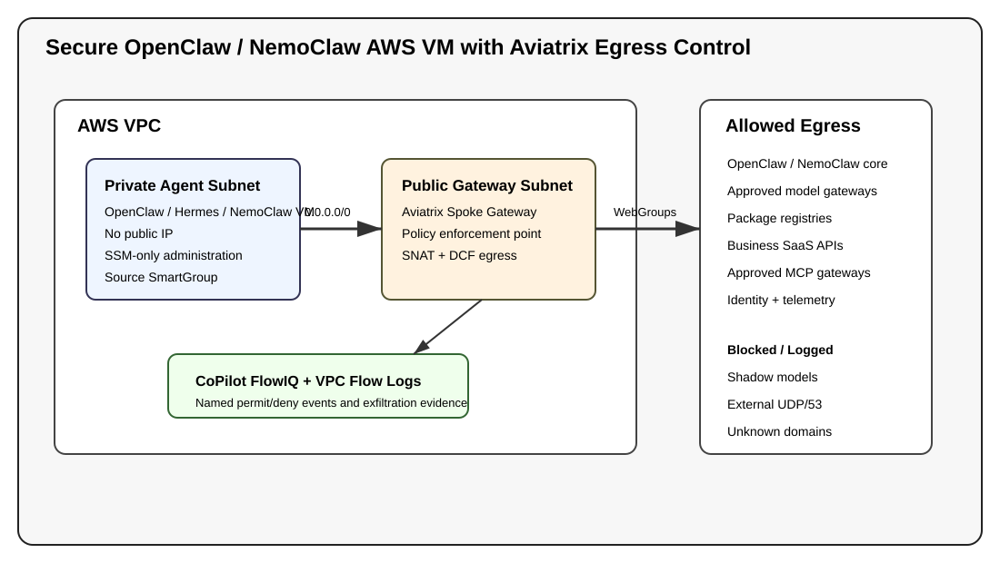

# Validated Containment Architecture — Secure Agent-Harness Egress on AWS with Aviatrix

This is a Validated Containment Architecture (VCA). It deploys a private AWS VM running an agent harness — OpenClaw, Hermes, NemoClaw, or your own — with no public IP and SSM-only access, and places an Aviatrix Spoke Gateway in the VPC egress path. Aviatrix Distributed Cloud Firewall (DCF) identifies the workload by CSP tag (a SmartGroup), logs every flow to CoPilot FlowIQ, and — once you move from monitor to enforce — permits only sanctioned destinations while denying shadow-model calls, DNS-tunneled exfiltration, east-west movement, and everything else via a default deny.

**Intended outcome:** the blueprint deploys in a *monitoring* state where all egress from the agent workload is permitted and logged. You observe the real traffic in FlowIQ, then progressively lock it down to your use case before switching to enforce. See "Outcome: monitor first, validate, then lock down" below.

Terraform provisions the workload network, the Aviatrix Spoke Gateway, the tag-based source SmartGroup, WebGroups, ordered DCF policies, CoPilot logging hooks, examples, and an `AGENTS.md` deployment guide.

> Validated against a live Aviatrix Controller and AWS account. Still run `terraform fmt`, `terraform validate`, and a monitor-mode deployment in your own environment before production use.

## Outcome: monitor first, validate, then lock down

Adopt this architecture in three stages. It ships configured for stage 1.

1. **Deploy in monitor (`policy_mode = "monitor"`, the default).** Every rule — the allows and the containment denies (shadow-model, DNS-exfil, east-west) and the default action — is `PERMIT + LOG`. Nothing is blocked; the agent runs normally and every egress flow is recorded.
2. **Validate from real traffic.** Run representative workloads for your harness, then in CoPilot FlowIQ filter by the workload SmartGroup (`<name_prefix>-sg-agent-workload`) and review what the agent actually reached. Sort what you see by intent — model/inference endpoints, package and update servers, business APIs, tool/MCP gateways, identity and telemetry. The exact destinations differ per harness and use case, so let the observed traffic drive the list rather than guessing up front.
3. **Lock down (`policy_mode = "enforce"`).** Promote the destinations you trust into the matching WebGroup variables, leave the containment denies in place, and switch to enforce. From then on only sanctioned egress is permitted; everything else is denied and logged.

The shipped WebGroup contents (OpenClaw / NVIDIA / package-registry defaults) are **starting points, not prescriptions** — trim or replace them for your harness. Because the source SmartGroup matches on CSP tag, the policy follows the workload even if its IP or subnet changes.

## Version history

See [`CHANGELOG.md`](CHANGELOG.md) for the full version history, including the fixes validated against a live Aviatrix Controller and AWS account (templatefile escaping, the SNAT vs. private-default-route conflict, shared-controller DCF safety, and the tag-based workload SmartGroup).

## Assumptions

A running Aviatrix Controller and (optionally) CoPilot are already available, and the target AWS account is onboarded to the Controller as an Aviatrix access account. The controller password is supplied via `TF_VAR_controller_password` (never committed). Never commit `terraform.tfvars`, state files, or saved plan files (`*.bin`) — they can contain secrets; see `.gitignore`.

## Architecture



```text
Practitioner
   |
   | AWS SSM Session Manager (no public SSH)
   v
Private OpenClaw/Hermes/NemoClaw VM  ---- default route ---->  Aviatrix Spoke Gateway  ----> Internet / SaaS / Model Gateway
   |                                                        |
   | Source SmartGroup: sg-agent-workload (CSP-tag match)   | DCF WebGroups + named rules
   |                                                        v
   +-----------------------------------------------> CoPilot FlowIQ + VPC Flow Logs
```

## What gets created

- AWS VPC with DNS support enabled.
- One public gateway subnet with Internet Gateway route for the Aviatrix Spoke Gateway.
- One or more private agent subnets with no native NAT Gateway and no direct Internet route.
- VPC Flow Logs to CloudWatch.
- Aviatrix Spoke Gateway using `terraform-aviatrix-modules/mc-spoke/aviatrix`.
- Private Ubuntu VM for OpenClaw/Hermes/NemoClaw terminal workflows.
- SSM-only administration path; no inbound security group rule and no public IP.
- Optional private VPC endpoints for SSM, SSM Messages, EC2 Messages, CloudWatch Logs, STS, and S3.
- Aviatrix SmartGroups for the agent subnet, VPC DNS resolver, optional model-gateway CIDRs, and east-west deny CIDRs.
- Aviatrix WebGroups for AWS infrastructure, OpenClaw/NemoClaw core, approved model gateways, package/source-control, approved SaaS APIs, approved MCP/tool gateways, identity/telemetry, optional public-reference, optional OS/update HTTPS destinations, and unapproved model providers.
- Ordered DCF policy list plus POST_RULES default action.
- Optional CoPilot association and remote syslog.

### Estimated cost

Rough on-demand AWS cost for the default single-AZ lab in `us-east-1`, excluding data transfer and any Aviatrix licensing. Prices vary by region — confirm with the [AWS Pricing Calculator](https://calculator.aws).

| Component | Default | Approx. cost |
|---|---|---|
| Aviatrix Spoke Gateway EC2 | `t3.medium` | ~$30/mo |
| Agent VM EC2 | `t3.large` | ~$60/mo |
| SSM/STS/Logs interface VPC endpoints | 5 endpoints | ~$36/mo (~$7.20 each) |
| S3 gateway endpoint | 1 | no hourly charge |
| VPC Flow Logs to CloudWatch | optional | usage-based |
| **Total** | | **~$125–135/mo** if left running |

Destroy the stack when not in use (`terraform destroy`) to avoid ongoing charges. Setting `create_ssm_vpc_endpoints=false` removes the largest fixed cost if your account already has private SSM connectivity.

## Policy evaluation order

All rule names are prefixed with your `name_prefix` (e.g. `openclaw-vca-shadow-model-deny`) so multiple deployments never collide on a shared controller.

| Priority | Rule | Mode | Purpose |
|---:|---|---|---|
| 10 | `<name_prefix>-shadow-model-deny` | monitor=`PERMIT+LOG`, enforce=`DENY+LOG` | Blocks unapproved model providers before broader allows. |
| 18/19 | `<name_prefix>-allow-vpc-dns-udp/tcp` | `PERMIT` | Keeps normal AWS VPC resolver DNS working. |
| 20/21 | `<name_prefix>-deny-dns-exfil-udp/tcp` | monitor=`PERMIT+LOG`, enforce=`DENY+LOG` | Blocks external DNS resolver paths. |
| 30 | `<name_prefix>-allow-aws-infra` | `PERMIT` | SSM, EC2, STS, Logs, ECR/S3 bootstrap/API access. |
| 31 | `<name_prefix>-allow-os-updates-https` | optional `PERMIT` | HTTPS package/update endpoints only. |
| 40/41 | `<name_prefix>-allow-model-gateways` | `PERMIT` | Sanctioned NVIDIA or enterprise model gateway destinations. |
| 50 | `<name_prefix>-allow-core` | `PERMIT` | OpenClaw/Hermes/NemoClaw core domains. |
| 60 | `<name_prefix>-allow-packages` | optional `PERMIT` | Terminal/coding workflows: npm, PyPI, GitHub, Hugging Face, Docker. |
| 70 | `<name_prefix>-allow-saas-apis` | optional `PERMIT` | Business APIs approved for this agent class. |
| 80 | `<name_prefix>-allow-mcp-gateways` | optional `PERMIT` | Enterprise MCP/tool gateways without flat internal reachability. |
| 90 | `<name_prefix>-allow-identity-telemetry` | optional `PERMIT` | Approved IdP and monitoring endpoints. |
| 95 | `<name_prefix>-allow-public-reference` | optional `PERMIT` | Search/weather/reference endpoints for demos only. |
| 100 | `<name_prefix>-deny-eastwest` | monitor=`PERMIT+LOG`, enforce=`DENY+LOG` | Limits lateral movement to adjacent/internal CIDRs. |
| POST_RULES | default action | monitor=`PERMIT+LOG`, enforce=`DENY+LOG` | Catches anything not explicitly allowed. |

## Default terminal workflow posture

The default is a balanced terminal-developer posture:

- OpenClaw/Hermes/NemoClaw core: `openclaw.ai`, `docs.openclaw.ai`, `clawhub.ai`, `www.nvidia.com`.
- Approved model endpoints: `integrate.api.nvidia.com`, `inference-api.nvidia.com`.
- Package/source-control workflow: npm, PyPI, GitHub/GitHubusercontent, Hugging Face, Docker.
- AWS infra: generated region-specific SSM, EC2, CloudWatch Logs, STS, ECR, and S3 endpoints.
- Public reference/search/weather is disabled unless `enable_public_reference=true`.

Move any direct model provider from `unapproved_model_provider_domains` to `approved_model_gateway_domains` only after approval. A plan-time guardrail blocks the same provider appearing in both lists.

## First-boot package-manager note

`install_bootstrap_packages=false` by default. Strict enforce mode can block HTTP-based Ubuntu `apt` mirrors because WebGroups are SNI/TLS-oriented. For production, prefer a baked AMI, private HTTPS package mirror, or monitor-mode bootstrap followed by enforce mode. The VM still stages installer scripts under `/opt/openclaw-vca` without running remote installers by default.

## Prerequisites

- Terraform >= 1.5.
- AWS credentials with permissions for VPC, EC2, IAM, CloudWatch Logs, VPC endpoints, and Flow Logs.
- Aviatrix Controller reachable from the Terraform runner.
- Aviatrix access account for the AWS account.
- Aviatrix Controller/provider 8.2+ for the POST_RULES default action resource.
- Optional CoPilot for FlowIQ and remote syslog ingestion.

## Tested With

| Component | Version |
|---|---|
| Aviatrix Controller | 8.2.x |
| Aviatrix Terraform Provider | 8.2.20 |
| `mc-spoke` module | 8.2.3 |
| Terraform | 1.9.x (>= 1.5) |
| AWS Provider | 5.100.0 (~> 5.0) |

The Aviatrix Controller/provider 8.2+ floor is required for the `aviatrix_distributed_firewalling_default_action_rule` (POST_RULES default action) resource.

## Deploy

```bash
cp terraform.tfvars.example terraform.tfvars
# edit terraform.tfvars
export TF_VAR_controller_password='your-controller-password'
make preflight
terraform plan
terraform apply
```

Access the private VM:

```bash
terraform output -raw ssm_start_session
aws ssm start-session --target <instance-id> --region <region>
```

Inside the VM:

```bash
sudo /opt/openclaw-vca/install-nemoclaw-openclaw.sh
# or
sudo /opt/openclaw-vca/install-nemohermes.sh
# or
sudo /opt/openclaw-vca/install-openclaw.sh
```

## Rollout pattern

1. Start with `policy_mode = "monitor"`.
2. Run representative terminal agent tasks.
3. In CoPilot FlowIQ, filter on SmartGroup `<name_prefix>-sg-agent-workload`.
4. Convert observed legitimate destinations into WebGroup variables by pull request.
5. Change `policy_mode = "enforce"`.
6. Run `POLICY_MODE=enforce /opt/openclaw-vca/verify-egress.sh`.

## Customization by agent class

Use `examples/agent-classes/*.tfvars` as copy points:

- `locked-down.tfvars` — regulated/sensitive agents.
- `coding-agent.tfvars` — terminal/coding default.
- `research-agent.tfvars` — demo/research with optional public reference.
- `customer-support-agent.tfvars` — SaaS + MCP gateway.
- `open-demo.tfvars` — workshop only.

For a viral internal rollout, expose these as an “agent egress vending machine”: developers request an agent class, platform creates a private SSM-accessible VM and monitor-mode policy, then FlowIQ evidence becomes a pull request to promote destinations.

## Variables

Required variables have no default and must be supplied. The full set with inline documentation is in [`variables.tf`](variables.tf); the most commonly used are below.

| Variable | Type | Default | Description |
|---|---|---|---|
| `aws_access_account` | string | _required_ | Aviatrix access account name for the AWS account. |
| `controller_ip` | string | _required_ | Aviatrix Controller IP or DNS name. |
| `controller_password` | string | _required_ | Controller password. Pass via `TF_VAR_controller_password`; never commit it. |
| `controller_username` | string | `admin` | Aviatrix Controller username. |
| `name_prefix` | string | `openclaw-vca` | Prefix for all AWS and Aviatrix object names. |
| `agent_class` | string | `coding` | Harness class: coding, research, support, healthcare-phi, hermes, custom. |
| `aws_region` | string | `us-east-1` | AWS region for the VPC, gateway, and VM. |
| `vpc_cidr` | string | `10.42.0.0/16` | CIDR for the agent VPC. |
| `availability_zone_count` | number | `1` | Number of private agent subnets (1–3). |
| `spoke_gateway_size` | string | `t3.medium` | Aviatrix Spoke Gateway instance size. |
| `agent_instance_type` | string | `t3.large` | EC2 instance type for the agent VM. |
| `single_ip_snat` | bool | `true` | Single-IP SNAT on the gateway; programs the private default route to its ENI. |
| `program_private_default_route` | bool | `false` | Keep false with SNAT (controller rejects both — AVXERR-TRANSIT-EDIT-0056). |
| `manage_controller_policy` | bool | `true` | When true, this blueprint owns the controller DCF policy list + default action. Set false on a shared controller. |
| `policy_mode` | string | `monitor` | `monitor` permits+logs would-be denies; `enforce` blocks them. |
| `log_permit_rules` | bool | `true` | Log named permit rules in CoPilot. |
| `enable_vpc_flow_logs` | bool | `true` | AWS-native VPC Flow Logs. Set false where SCPs block `ec2:DeleteFlowLogs`. |
| `create_ssm_vpc_endpoints` | bool | `true` | Private interface endpoints for reliable SSM access. |
| `create_s3_gateway_endpoint` | bool | `true` | S3 gateway endpoint for AWS-private artifact paths. |
| `agent_workload_tag_key` / `agent_workload_tag_value` | string | `Role` / `openclaw-agent-harness` | CSP tag the source SmartGroup matches on. |
| `install_mode` | string | `nemoclaw` | Installer staged on the VM: none, openclaw, nemoclaw, hermes. |
| `auto_run_installer` | bool | `false` | Run the installer on first boot (otherwise stage only). |
| `enable_package_installs` | bool | `true` | Allow package/source-control destinations for coding agents. |
| `enable_public_reference` | bool | `false` | Allow broad public-reference presets (demo only). |
| `approved_model_gateway_domains` | list(string) | NVIDIA endpoints | Approved model gateway/provider FQDNs. |
| `package_registry_domains` | list(string) | npm/PyPI/GitHub/HF/Docker | Package & source-control destinations. |
| `approved_saas_api_domains` / `approved_mcp_gateway_domains` / `identity_and_telemetry_domains` | list(string) | `[]` | Optional allow lists; no rule created when empty. |
| `unapproved_model_provider_domains` | list(string) | major SaaS LLM APIs | Shadow-model deny list, evaluated before allows. |
| `east_west_deny_cidrs` | list(string) | RFC1918 ranges | CIDRs denied after explicit allows (lateral-movement containment). |

## Outputs

| Output | Description |
|---|---|
| `vpc_id` | AWS VPC ID. |
| `agent_instance_id` | Private agent VM instance ID (use with SSM). |
| `agent_private_ip` | Private IP of the agent VM. |
| `agent_private_subnet_ids` | Private subnets protected by the Spoke Gateway path. |
| `agent_private_route_table_id` | Private route table receiving the gateway default route. |
| `agent_private_cidrs` | Private CIDRs of the agent subnets. |
| `vpc_dns_resolver_ip` | VPC DNS resolver IP allowed before the external-DNS deny. |
| `agent_source_smart_group` | Tag-based source SmartGroup name used in agent policies. |
| `aviatrix_spoke_gateway` | Spoke Gateway object from the mc-spoke module (sensitive). |
| `policy_mode` | Current DCF mode (monitor/enforce). |
| `managed_controller_policy` | Whether this deployment owns the controller policy list. |
| `ssm_start_session` | Ready-to-run `aws ssm start-session` command for the VM. |
| `ssm_interface_endpoint_ids` | Interface VPC endpoint IDs used for SSM access. |
| `s3_gateway_endpoint_id` | S3 gateway endpoint ID (null when disabled). |
| `vpc_flow_log_group` | CloudWatch log group for VPC Flow Logs (null when disabled). |
| `agent_class` | Agent class tag for this deployment. |
| `next_steps` | Ordered operator next steps after apply. |

## Test scenarios

After `terraform apply`, validate enforcement from the private VM. The full, copy-pasteable suite is in [`tests/test-scenarios.md`](tests/test-scenarios.md); it covers:

1. Permit passes — OpenClaw/NemoClaw core domains.
2. Permit passes — approved model gateway.
3. Optional permit — HTTPS OS/update path.
4. Terminal package workflow permit (npm, PyPI, GitHub).
5. Shadow-model provider blocked (`<name_prefix>-shadow-model-deny`).
6. DNS exfiltration blocked while VPC resolver still works.
7. Default-deny catches unknown destinations (POST_RULES).
8. East-west isolation to adjacent RFC1918 addresses.
9. Live policy update — deny, add FQDN, apply, re-test permit.
10. Guardrail validation — same domain in approve+deny lists fails `terraform plan`.

In monitor mode, "blocked" tests still connect but produce named log events; in enforce mode they fail. This is the evidence you use to promote destinations before switching to enforce.

## Cleanup

```bash
terraform destroy
```

If the Aviatrix Controller manages other DCF policies, do not destroy or apply this blueprint from the same controller without understanding that `aviatrix_distributed_firewalling_policy_list` and `aviatrix_distributed_firewalling_default_action_rule` are controller-level policy resources.

## Troubleshooting

- **SSM session does not connect:** keep `policy_mode="monitor"`, keep `create_ssm_vpc_endpoints=true`, verify endpoint security groups allow the private subnet, and verify the instance has the SSM IAM profile.
- **Installer cannot reach a domain:** find the denied flow in CoPilot, confirm business need, add exact FQDN to the right variable, apply again.
- **Unexpected permit in enforce mode:** check if the destination is matched by a broad wildcard in a WebGroup or by `enable_public_reference=true`.
- **No deny logs:** verify CoPilot association, remote syslog index, VPC Flow Logs, and DCF enablement.
- **Another blueprint overwrites policies:** consolidate DCF policy resources into a shared controller-level module or set `manage_controller_policy=false` here.
